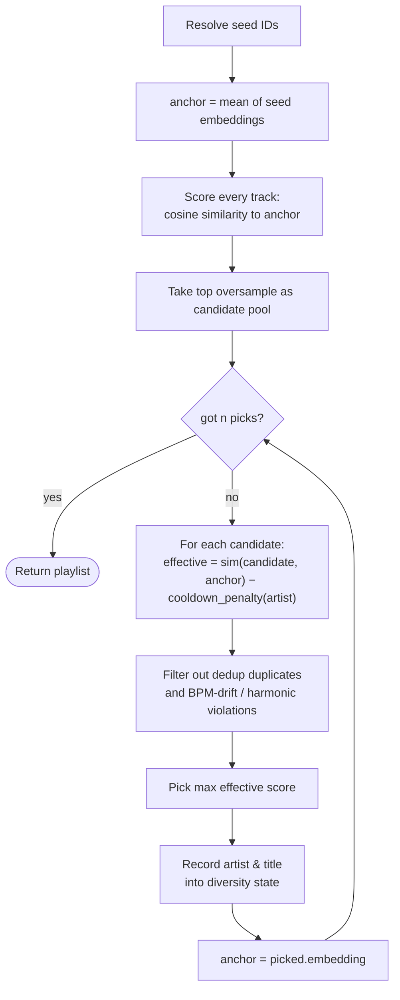
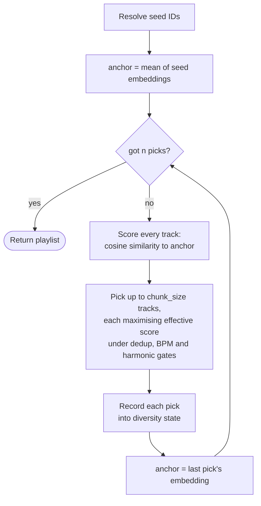

# harmonie API reference

HTTP API for similarity queries, style filtering, and playlist generation. The service itself (install, configuration, running as a service) is documented in the [README](README.md).

## Endpoints

All endpoints are versioned under `/api/v1/`. If `HARMONIE_API_KEY` is set, every authenticated request must include `X-API-Key: <key>`. `GET /health` is always public.

| Method | Path | Purpose |
| --- | --- | --- |
| `GET`  | `/health` | Liveness probe |
| `GET`  | `/api/v1/status` | Service overview: version, libraries, model, versions, track counts, duration, db size, by-model |
| `GET`  | `/api/v1/scan` | Current scan state and counters |
| `POST` | `/api/v1/scan` | Trigger a scan now (`?force=true` to ignore mtime/size) |
| `GET`  | `/api/v1/tracks` | List tracks (filter + pagination) |
| `GET`  | `/api/v1/tracks/{id}` | Full track record |
| `GET`  | `/api/v1/tracks/{id}/similar` | Top-N similar tracks |
| `GET`  | `/api/v1/tracks/resolve` | Find one track by `path` and/or tags |
| `GET`  | `/api/v1/genres` | Enumerate top-level Discogs genres in the library |
| `GET`  | `/api/v1/styles` | Enumerate Discogs-400 styles (optionally scoped by genre) |
| `POST` | `/api/v1/playlists` | Build a playlist (mode set explicitly in the body) |

OpenAPI docs are served at `/docs` (Swagger UI) and `/openapi.json`.

### Filters

Both URL and body forms accept the same filters and produce the same internal `TrackFilter`. Pick whichever shape fits the call site.

URL form (`/tracks`, `/tracks/{id}/similar`):

```
?bpm=120..130        closed range
?bpm=120..           lower bound only
?bpm=..130           upper bound only
?bpm=128             exact value
?key=A&key=B         set membership (repeat the parameter)
?genre=Electronic    every Electronic--- style
?style=House         every ---House style across genres
?genre=Electronic&style=House   exact Electronic---House
?style_min=0.5       only count style rows above this probability
?style_mode=all      tracks must match every requested constraint (default: any)
```

Available filter fields: `bpm`, `danceability`, `loudness`, `key`, `scale`, `genre`, `style`, `style_min`, `style_mode`.

Genre and style values must not contain `---`. The separator is an internal label format; pass both axes for an exact label.

Body form (`POST /playlists` under `filter`):

```json
{
  "filter": {
    "bpm":      { "gte": 120, "lte": 130 },
    "loudness": { "lte": -10 },
    "key":      ["A", "B"],
    "scale":    "minor",
    "genre":    ["Electronic"],
    "style":    ["House"],
    "style_min": 0.5,
    "style_mode": "any"
  }
}
```

### Mapping harmonie tracks to an external catalog

Track and match responses include the metadata you need to look a track up in another system without doing a filesystem walk.

* `artist`, `album`, `title`, `track_number`: the tag-based match. The four fields together are usually enough to identify a track unambiguously.
* `library_root`, `relative_path`: the path-based match. If the consumer sees the same library layout under a different mount point, it joins on `relative_path` directly. No path-prefix mapping config in the common case.

`library_root` reflects the configured `HARMONIE_LIBRARIES` entries at scan time. If you reconfigure mount points, re-scan to refresh.

`GET /api/v1/tracks/resolve` exposes this matching directly. Pass any subset of `{path, artist, album, title}` as query params. The endpoint runs a multi-strategy ladder (exact path → relative path → full tag triple → looser tag pair, all NOCASE for tags) and returns the first hit (smallest id wins on ties):

```bash
# By tags.
curl --get http://localhost:8842/api/v1/tracks/resolve \
  --data-urlencode 'artist=Aphex Twin' \
  --data-urlencode 'album=SAW' \
  --data-urlencode 'title=Xtal' | json_pp

# By path (works against the absolute path or relative_path).
curl --get http://localhost:8842/api/v1/tracks/resolve \
  --data-urlencode 'path=Aphex Twin/SAW/01 Xtal.flac' | json_pp
```

400 on an empty request, 404 if no strategy matches.

### Genres and styles

During scan, harmonie runs Essentia's Discogs-400 classifier head on the same Effnet embeddings used for similarity. Each track gets a 400-dimensional probability vector over labels like `Electronic---House`, `Hip Hop---Trap`, or `Rock---Punk`. The top 10 (and any above 5% probability) are stored as filterable rows; the full vector is kept as a BLOB for clustering.

The taxonomy is two-level — a **genre** (left side) like `Electronic` or `Rock`, and a **style** (right side) like `House` or `Punk`. The two axes are filtered independently:

```bash
# All Electronic tracks (any style under the genre).
curl --get 'http://localhost:8842/api/v1/tracks' --data-urlencode 'genre=Electronic' | json_pp

# All House tracks across genres (Electronic House, Pop House, ...).
curl 'http://localhost:8842/api/v1/tracks?style=House' | json_pp

# Both axes → exact label. This is the cheapest form (single indexed equality).
curl --get 'http://localhost:8842/api/v1/tracks' \
  --data-urlencode 'genre=Electronic' \
  --data-urlencode 'style=House' | json_pp

# Multiple values on either axis. Default is `any`; use style_mode=all for AND.
curl --get 'http://localhost:8842/api/v1/tracks' \
  --data-urlencode 'genre=Electronic' \
  --data-urlencode 'genre=Rock' | json_pp

# Demand confidence: only count style rows above 0.5 probability.
curl 'http://localhost:8842/api/v1/tracks?genre=Electronic&style_min=0.5' | json_pp
```

`---` in a `genre` or `style` value is rejected with a 400 — the separator is internal. Use the two-axis form for an exact label.

Discovery endpoints walk the hierarchy:

```bash
# Top-level genres present in the library.
curl 'http://localhost:8842/api/v1/genres' | json_pp

# Styles within one genre.
curl 'http://localhost:8842/api/v1/styles?genre=Electronic' | json_pp

# Every style, gated by probability.
curl 'http://localhost:8842/api/v1/styles?style_min=0.5' | json_pp
```

### Playlists

`POST /api/v1/playlists` builds every kind of playlist. The body has a required `mode` field that selects the strategy. Each mode has its own validated schema; there are no hidden parameter coupling rules.

**Picking a mode:**

| Use case | Mode |
| --- | --- |
| "More tracks like this one" | `similar` with one seed |
| "More like these few" | `similar` with multiple seeds |
| "An endless radio" | `similar`, then re-seed with the last few items |
| "A long mix that gradually changes style" | `drift` |
| "Tracks at ~128 BPM, danceable, electronic, shuffled" | `vibe` with `filter` + `target` |

#### Common parameters

These apply to every mode:

| Field | Default | Purpose |
| --- | --- | --- |
| `n` | `20` | How many tracks to return (1–500). |
| `filter` | _(none)_ | Hard candidate-pool gate. See [Filters](#filters). |
| `artist_cooldown` | `true` | When `true` (default), apply a soft cooldown that discourages picking tracks from the same artist in quick succession. The penalty fades over the next few picks, so an artist re-enters the pool gradually rather than snapping back in. A clearly more-similar same-artist track can still win — the cooldown nudges the order, it doesn't ban. Set to `false` to disable. Tracks with no `artist` tag are unaffected. |
| `dedupe_titles` | `true` | Skip tracks whose `(artist, title)` tag pair already appeared earlier in the playlist — same song from multiple albums or compilations shows up only once. Comparison is case-insensitive and whitespace-trimmed. Set to `false` to keep duplicates. Unlike the cooldown, the dedup never relaxes. |

#### Mode `similar`: track radio

The seeds anchor the playlist; results stay close to their embedding centroid. This is the "Track Radio" surface.



```bash
# Minimum: 20 tracks similar to track 42.
curl -X POST http://localhost:8842/api/v1/playlists \
  -H 'content-type: application/json' \
  -d '{"mode": "similar", "seeds": [42]}' | json_pp

# Tighter: multi-seed, smooth transitions, hard filter, include the seeds.
curl -X POST http://localhost:8842/api/v1/playlists \
  -H 'content-type: application/json' \
  -d '{
    "mode": "similar",
    "seeds": [42, 117],
    "n": 30,
    "smooth_transitions": { "bpm_tolerance": 5, "key_compatible": true },
    "filter": { "bpm": { "gte": 120, "lte": 140 }, "style_min": 0.3 },
    "include_seeds": true
  }' | json_pp
```

**Endless radio.** The endpoint returns a fixed `n`. To keep going, re-seed from the tail of the previous response:

```bash
seed=$(curl -sX POST http://localhost:8842/api/v1/playlists \
  -H 'content-type: application/json' \
  -d '{"mode":"similar","seeds":[42],"n":20}' \
  | jq '[.items[-3:][].track_id]')
# Next batch is "music like the last 3 tracks of the previous batch."
curl -X POST http://localhost:8842/api/v1/playlists \
  -H 'content-type: application/json' \
  -d "{\"mode\":\"similar\",\"seeds\":$seed,\"n\":20}" | json_pp
```

#### Mode `drift`: chunked walk

`drift` walks gradually away from the seeds' embedding centroid. Each chunk of `chunk_size` tracks is anchored on the last pick, so the playlist evolves in style as it goes. One seed or several — both work; with multiple seeds, the centroid is the starting anchor.



```bash
curl -X POST http://localhost:8842/api/v1/playlists \
  -H 'content-type: application/json' \
  -d '{
    "mode": "drift",
    "seeds": [42],
    "n": 30,
    "chunk_size": 5,
    "smooth_transitions": { "key_compatible": true }
  }' | json_pp
```

Tuning `chunk_size`:

* `1`: every new track becomes the next anchor. Drifts the fastest.
* `5` (default): re-anchors every five picks. Signature drift behaviour.
* `20`: re-anchors rarely. Stays close to the seed for most of the playlist.
* `n` (= total length): equivalent to `similar` mode (no re-anchoring).

Scores typically jump at chunk boundaries because the first track of each chunk is measured against a new anchor, not the original seed.

#### Mode `vibe`: descriptor-driven

No seeds. The `filter` block narrows the candidate pool; the `target` block ranks within it by closeness.

```mermaid
flowchart TD
    A[Apply filter:<br/>BPM range, styles, etc.] --> B[Score each row by<br/>closeness to target fields<br/>= fitness]
    B --> C{shuffle requested?}
    C -- yes --> D[Random shuffle pool]
    C -- no --> E[Order by fitness desc]
    D --> F{got n picks?}
    E --> F
    F -- yes --> Z([Return playlist])
    F -- no --> G["For each row:<br/>effective = fitness − cooldown_penalty(artist)"]
    G --> H[Pick max effective<br/>skipping (artist, title) duplicates]
    H --> I[Record artist & title<br/>into diversity state]
    I --> F
```

```bash
curl -X POST http://localhost:8842/api/v1/playlists \
  -H 'content-type: application/json' \
  -d '{
    "mode": "vibe",
    "n": 30,
    "filter": { "bpm": { "gte": 120, "lte": 130 } },
    "target": { "bpm": 128, "danceability": 1.5 },
    "shuffle": true,
    "rng_seed": 42
  }' | json_pp
```

#### Inline path or tag references

If the client only has paths or tags, not harmonie's IDs, send `seed_refs` instead of (or alongside) `seeds`. Each entry is the same shape as `GET /tracks/resolve`:

```bash
curl -X POST http://localhost:8842/api/v1/playlists \
  -H 'content-type: application/json' \
  -d '{
    "mode": "similar",
    "n": 20,
    "seed_refs": [
      { "path": "/music/Album/01.flac" },
      { "artist": "Aphex Twin", "album": "Selected Ambient Works", "title": "Xtal" },
      { "artist": "Daft Punk", "title": "One More Time" }
    ]
  }' | json_pp
```

Harmonie resolves each ref server-side via the same ladder as `/tracks/resolve` (exact path, then `relative_path`, then `artist+album+title`, then `title+artist` or `title+album`). Refs that don't match a track come back under `unresolved_seed_refs`:

```json
{
  "items": [ ... ],
  "unresolved_seed_refs": [
    { "ref": { "artist": "Daft Punk", "title": "One More Time" }, "reason": "no_match" }
  ]
}
```

The playlist is built from whichever refs did resolve. The request fails with 400 only if every ref *and* every explicit `seeds` ID fail to resolve.

`seeds` and `seed_refs` can be combined. The merged seed list keeps `seeds` order first, then resolved-ref order, deduped.

#### Body field reference

| Field | Modes | Default | Range | Purpose |
| --- | --- | --- | --- | --- |
| `mode` | all | required | `similar` \| `drift` \| `vibe` | Strategy selector. |
| `n` | all | `20` | 1–500 | Number of tracks to return. |
| `filter` | all | none | | Hard candidate-pool constraints. Same shape as the URL filter, in body form. |
| `seeds` | similar, drift | `[]` | ≥0 | Pre-resolved track IDs. Combine with `seed_refs` for "I have a few IDs and a few paths." |
| `seed_refs` | similar, drift | `[]` | ≥0 | Inline path/tag references resolved server-side via the `/tracks/resolve` ladder. At least one of `seeds` or `seed_refs` must be non-empty. |
| `include_seeds` | similar, drift | `false` | | Include the seed track(s) in the result. |
| `smooth_transitions.bpm_tolerance` | similar, drift | `null` | ≥0 | Max BPM gap between consecutive picks. Lenient on missing BPMs. |
| `smooth_transitions.key_compatible` | similar, drift | `false` | | Restrict consecutive picks to harmonically compatible keys (Camelot wheel: same key, ±1 number, parallel mode). Strict: tracks without key info are dropped. |
| `chunk_size` | drift | `5` | 1–100 | Tracks per anchor before re-anchoring on the last pick. Larger stays closer to the seeds; smaller drifts faster. |
| `target.bpm` | vibe | `null` | >0 | Soft preference. Tracks closer to this BPM rank higher. |
| `target.danceability` | vibe | `null` | ≥0 | Soft preference for closeness to this danceability score. |
| `shuffle` | vibe | `true` | | Randomise the (post-target) pool before truncation. |
| `rng_seed` | vibe | `null` | | Seed for reproducible shuffling. `null` is fresh randomness each call. |

The bare-minimum body for `similar`/`drift` (`mode` and `seeds`) returns 20 tracks with no BPM/key constraints, seeds excluded from output, and (for drift) chunks of 5.

### Cross-cutting examples

```bash
# Trigger a scan and watch its progress.
curl -X POST 'http://localhost:8842/api/v1/scan?force=true' | json_pp
while [ "$(curl -sS http://localhost:8842/api/v1/scan | jq -r .state)" != "idle" ]; do
  sleep 5
done

# Find every Hard Techno track at 140+ BPM, sorted by BPM ascending.
curl --get http://localhost:8842/api/v1/tracks \
  --data-urlencode 'genre=Electronic' \
  --data-urlencode 'style=Hard Techno' \
  --data 'bpm=140..' --data 'order_by=bpm' | json_pp

# Resolve a track by tags, then ask for 20 similar with key compatibility.
id=$(curl --get http://localhost:8842/api/v1/tracks/resolve \
  --data-urlencode 'artist=Aphex Twin' \
  --data-urlencode 'title=Xtal' | jq .id)
curl -X POST http://localhost:8842/api/v1/playlists \
  -H 'content-type: application/json' \
  -d "{\"mode\":\"similar\",\"seeds\":[$id],\"n\":20,
       \"smooth_transitions\":{\"key_compatible\":true}}" | json_pp
```

